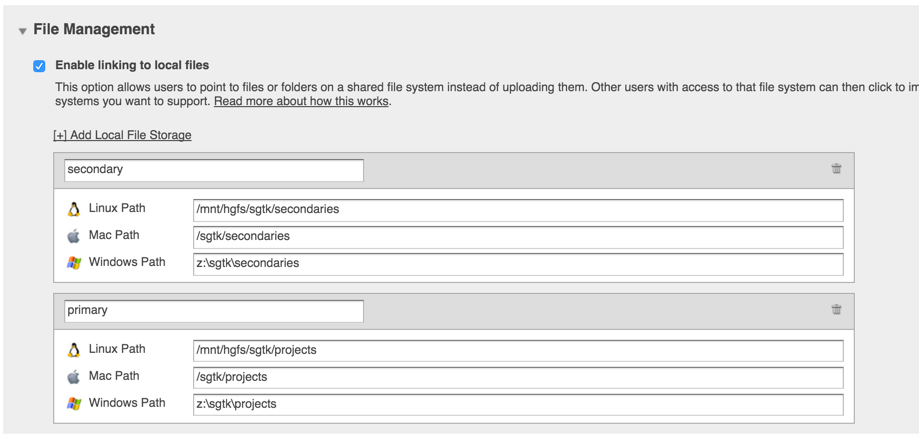
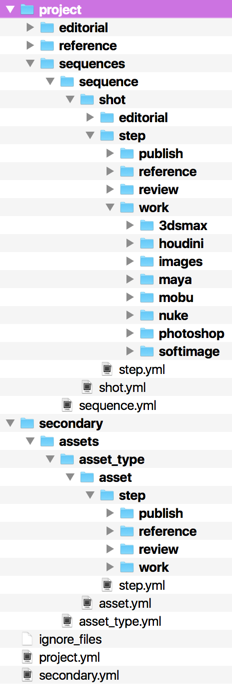

# How do I modify my configuration to use multiple storage roots?

The Default Configuration we provide is set up to use a single local storage root (i.e, all of your project files are stored underneath a single root point like `/sgtk/projects`). You may want to add a new storage root to store some of your project files. This is a common situation that arises when you're running out of disk space or want some media to be on a faster storage, etc.
Let’s say you want to add another root named “secondary”. Here are the steps you need to take:

## Add the local storage in 

- In , navigate to the **Admin > Site Preferences** page
- Open up the **File Management** section
- Click on **[+] Add Local File Storage**
- Fill out the name ("secondary") and the paths to the storage root on all of the relevant platforms. _If you're not using a particular platform, you can simply leave it blank._
- Click on the **Save Page** button on the top or the bottom of the page

## Add the new root to your pipeline configuration

Toolkit caches information about the local storages used in a pipeline configuration in the `config/core/roots.yml` file. Edit this file to add the new **secondary** storage root you just created in :

    primary: {
        linux_path: /mnt/hgfs/sgtk/projects,
        mac_path: /sgtk/projects,
        windows_path: 'z:\sgtk\projects'
    }
    secondary: {
        linux_path: /mnt/hgfs/sgtk/secondaries,
        mac_path: /sgtk/secondaries,
        windows_path: 'z:\sgtk\secondaries'
    }

{% include info title="Note" content="As of `tk-core v0.18.141`, the names of the roots defined in roots.yml do not need to match the names of the local storage defined in SG. You can explicitly define the connection by including a `shotgun_storage_id: <id>` key/value pair in your `roots.yml` definitions.
Example:

    secondary: {
        linux_path: /mnt/hgfs/sgtk/secondaries,
        mac_path: /sgtk/secondaries,
        windows_path: 'z:\sgtk\secondaries'
        shotgun_storage_id: 123
    }

The storage id is currently only queryable via an API call." %}

## Modify your schema to use your new local storage root

Now that you've defined the new storage root and essentially told Toolkit about it, you need to decide how you're going to use it in your directory structure. For this example, let's assume you want all of your asset work to go in the secondary storage, and all of your shot work to go in the primary storage. You might setup your schema to look like the following in `config/core/schema`:

**config/core/schema/project.yml**

    # the type of dynamic content
    type: "project"

    # name of project root as defined in roots.yml
    root_name: "primary"

**config/core/schema/secondary.yml**

    # the type of dynamic content
    type: "project"

    # name of project root as defined in roots.yml
    root_name: "secondary"

You will also need to modify any YAML files that reference the root in their filters.
For example, if you had an asset.yml somewhere under your secondary folder, then you need to update the filters so that it filters the project against the secondary folder value.

    filters:
        - { "path": "project", "relation": "is", "values": [ "$secondary" ] }
        - { "path": "sg_asset_type", "relation": "is", "values": [ "$asset_type"] }

## Update your template paths to specify which root to use

Finally you will update1 the paths defined in your `config/core/templates.yml` file to specify which storage root to use, and update any of the paths as necessary. Remember that your template paths are very good friends with your schema and they need to match up. If you have a template path defined that doesn't match correctly with the path defined in your schema, you'll run into errors.

For example, since we want to have all of our asset work on the secondary storage, to update the maya_asset_work template path, we'd modify it to look like this:

    maya_asset_work:
        definition: '@asset_root/work/maya/{name}.v{version}.ma'
        root_name: 'secondary'

You should follow this same pattern for each template path in your `config/core/templates.yml` file. Specify the correct `root_name` for each one (**'primary'** or **'secondary'**).



1 _It is worth noting that updating the paths might not be ideal, since any old files that were created using the previous value will not be accessible by Toolkit once the new value is set (e.g. old work files won't be found by Toolkit after changing their template path). If this is a concern, you may then create a new template (e.g. houdini_shot_publish_v2) with the new location and upgrade your apps to use that new version. Not all apps handle a fallback concept like this, but this will allow some apps to recognize the old files. This does not affect publishes, as these are always linked to their publish in ._
