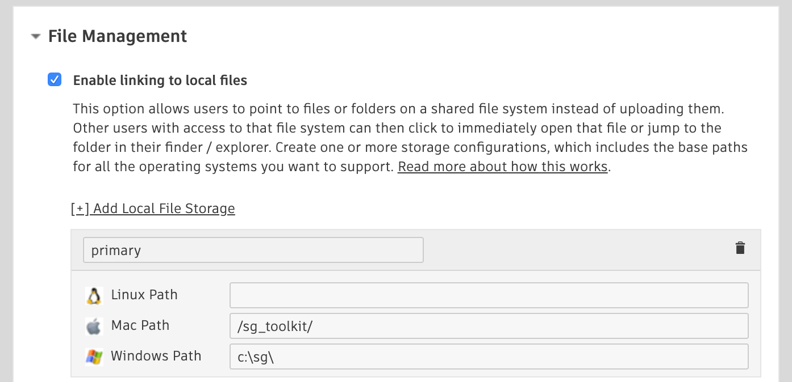

# How do I move my project directories to a new Local Storage root?



Sometimes it's necessary to move your project files (scene files, renders, etc.) to a new root storage location (eg. from `/mnt/smalldrive` to `/mnt/bigdrive/foo`). This can be done whether you're using a single or multi-root configuration. For example, lets say we want to move your storage named **"asset_storage"**:

- Copy (or move) your project files from the old location to the new location.
- In Shotgun, navigate to the **Admin > Site Preferences** page and open the **File Management** section.
    
- Update the Local File Storage named "primary" with the paths for each platform to the new storage for your project files. If you're not using a specific platform, just leave it blank.
- Click on the **"Save Changes"** button on the top or bottom of the page.
- Update your `config/core/roots.yml` file in your project configuration to match the new path values you just saved in Shotgun.

Toolkit stores publish paths as relative paths from a storage root. So with the old storage root the path was expanded like so:

    [asset_storage]/assets/Character/betty => /mnt/smalldrive/assets/Character/betty

With the new storage root definition, the path is now expanded like this:

    [asset-storage]/assets/Character/betty => /mnt/bigdrive/foo/assets/Character/betty

and we don't need to worry about updating any other publish information in Shotgun or Toolkit! 



## References

If any of your scene files have references in them that are pointing to the old path, you'll need to update these on your own, or make symlinks to ensure that they get resolved correctly.

## Versions

If you have Version entities in Shotgun that store information in the Path to Movie or Path to Frames fields that are affected by this change, these will also have to be updated to point to the new location since these fields are string fields that contain an absolute path to the media.