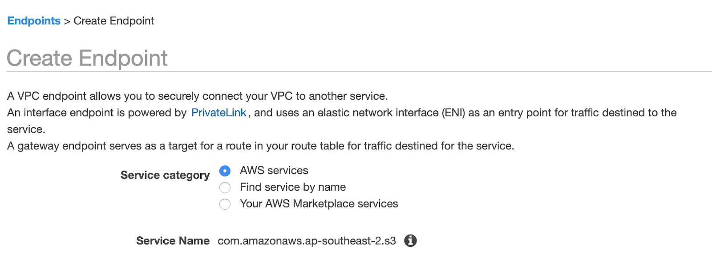

# Media Traffic Isolation using AWS PrivateLink for Amazon S3



The media traffic isolation feature allows your users to access media in your AWS S3 bucket privately (not transiting over the public Internet). Please note that if you have a multi-region setup and that leverages the Shotgun Transcoding service there may still be instances where media transits across the public Internet. Reach out to our support team for more details.

Media Isolation activation is a pre-requisite to enable this feature. If you haven't done so already, see [Media Isolation](./s3_bucket.md).

## Set up a VPC in your S3 bucket AWS region



You will need to deploy a VPC with the required VPC endpoint. We provide a [private VPC](https://sg-shotgunsoftware.s3-us-west-2.amazonaws.com/tier1/cloudformation_templates/sg-private-vpc-privatelink-s3.yml) CloudFormation templates as starting points. These template create the necessary VPCs, subnets and VPC endpoint.

* Create a [new CloudFormation stack](https://console.aws.amazon.com/cloudformation/home?#/stacks/create/template)
* Select Template is ready
* Set Amazon S3 URL to [`https://sg-shotgunsoftware.s3-us-west-2.amazonaws.com/tier1/cloudformation_templates/sg-private-vpc-privatelink-s3.yml`](https://sg-shotgunsoftware.s3-us-west-2.amazonaws.com/tier1/cloudformation_templates/sg-private-vpc-privatelink-s3.yml)
* Click Next
* Set a stack name. Eg. `shotgun-vpc`
* Choose network ranges that doesn't conflict with your studio network and set subnet CIDR values accordingly
* Set your S3 bucket name
* Click Next
* Click Next

## Set up access from your site network to your AWS VPC

Options provided by AWS:
* [AWS Site-to-Site VPN](https://docs.aws.amazon.com/vpn/latest/s2svpn/VPC_VPN.html)
* [AWS Direct Connect](https://aws.amazon.com/directconnect/)



## Add an S3 endpoint to your VPC



[TODO]

### Add S3 proxy VPC to S3 bucket policy

[TODO: Double Check]

In order for the S3 proxy to communicate with your S3 bucket your bucket policy must allow access from the S3 proxy's VPC. You can find instructions on how to configure the policy in the [Fine Tuning](./tuning.md#s3-bucket-policy) step.

## Validation

### Test the S3 proxy

[TODO]
Try to access your S3 proxy using the ping route. Eg. `https://s3-proxy.mystudio.com/ping`

### Configure your test site to use the S3 proxy

* Please contact Shotgun support via the dedicated Slack channel and provide the following information:
  * Your S3 bucket name
  * Your S3 Privatelink DNS Name
* Shotgun will configure your test site to use your S3 privatelink.
* Confirm that you are still able to access existing media
* Attempt to upload new media

## Next Steps

See [Web Traffic Isolation](./traffic_segregation.md) to activate the Web Traffic Isolation feature.

See [Media Replication](./s3_replication.md) to activate the Web Traffic Isolation feature.

Go to [Setup](./setup.md) for an overview of the possible next steps.
