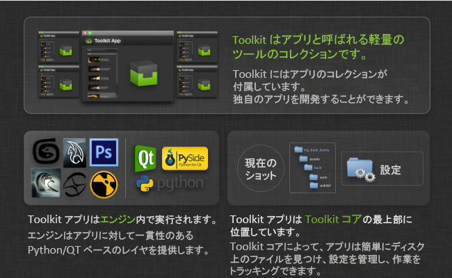
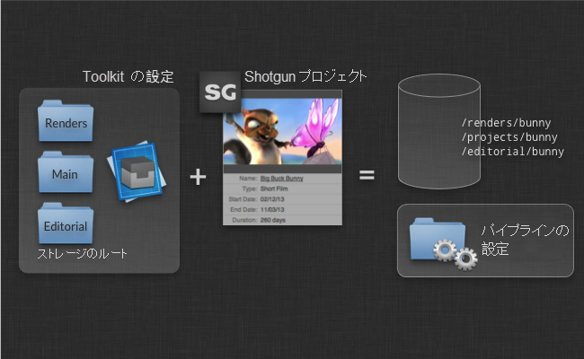
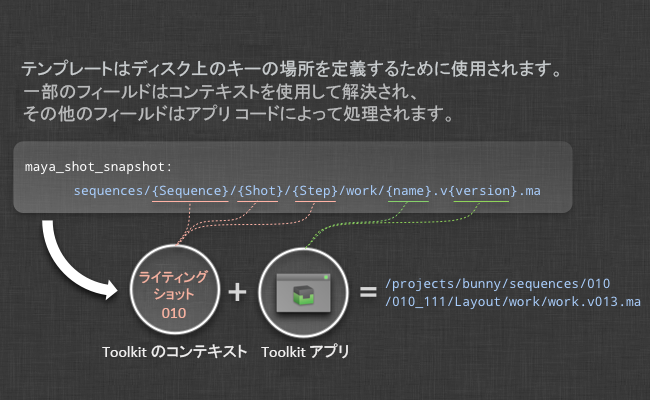
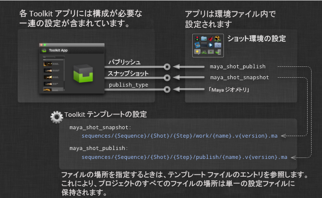

# Toolkit の概要


#  Pipeline Toolkit のさまざまなコンセプトの概要

ここでは、アプリとエンジンの仕組み、Toolkit の起動方法と現在のコンテキスト(作業領域)の管理方法、ディスク上にフォルダを作成する方法など、主要なコンセプトについて詳細に説明します。環境設定と開発に関与するユーザはここから始めることをお勧めします。

_このドキュメントは、Toolkit の設定を管理するユーザのみが使用可能な機能について説明します。詳細については、『[ 統合管理者ガイド](https://support.shotgunsoftware.com/hc/ja/articles/115000067493)』を参照してください。_

# はじめに

このドキュメントでは、いくつかの主要機能の詳細について説明します。説明、例、簡単なデモを通じて、Toolkit のすべてがおわかりいただけると思います。このドキュメントは、Toolkit に慣れる方法や、Toolkit のメリットを紹介する初心者向けのドキュメントです。すべての内容を確認すれば、いくつかの主要なコンセプトとそのコンセプトの仕組みを理解できます。



以下に、Toolkit (SGTK)の簡単な説明を示します。

- Toolkit は  プラットフォームを使用する Pipeline Toolkit です。このツールキットを使用すると、簡単にツールを作成してインストールできます。__
- Toolkit はファイル システム ベースのツールです。ディスク上の格納場所を整理できるため、ディスク上で管理するものを適切に構造化できます。
- Toolkit は支援ツールです。パイプラインでデータを引き継いだり抽出化することはありませんが、アーティストが情報を見つけやすく、ミスを防ぐことができるようにする優れたツールです。
- Toolkit は、パブリッシュしたものをすべて  に保存して作業を共有できるようにします。Toolkit を使用すると、制作上の更新や作業を簡単に共有できます。

次のセクションでは、Toolkit の詳細とその仕組みについて説明します。

# プロジェクトと環境設定

Toolkit の環境設定は、すべてプロジェクト中心に行います。プロジェクトは通常、 内でライフサイクルを開始し、入札とプリプロダクションの段階を経て、コンテンツを作成できる段階になったら、Toolkit をプロジェクトに合わせて設定します。



新しいプロジェクトをセットアップする場合は、__テンプレート設定を使用します。テンプレート設定には、エンジンとアプリ、ファイル システムの設定、およびその他の設定があらかじめ定義されています。Toolkit を初めて使用する場合は、まずはサンプルの設定を使用して吟味してみてください。別のプロジェクトで Toolkit を既に使用したことがある場合は、新しいプロジェクトでもまずはその設定を使用してみることをお勧めします。この方法では、スタジオの設定を展開して、それぞれの新しいプロジェクトに合わせて調整できます。もちろん、スタジオの設定を個別に管理し、新しいプロジェクトすべてのテンプレートとして使用することもできます。

それぞれの設定を使用して、数多くのストレージ ポイント__を定義します。標準のサンプル設定「`tk-config-default`」の場合、__プライマリと呼ばれる 1 つのストレージ ポイントを定義します。つまり、すべてのプロダクション データは 1 つのファイル システムのプロジェクト ルート内に格納されます。また、複数のファイル システムのルートを使用して設定をセットアップすることもできます。これは__「マルチルート設定」と呼ばれます。マルチルート設定が必要な例としては、レンダリングや編集用の個別ストレージを設定する場合などがあります。各ストレージ ポイントは、  のローカル ファイル ストレージにする必要があります。これは、[サイト基本設定](Site Preferences)の[ファイル管理](File Management)タブで設定できます。____

Toolkit は、任意の場所に実際のプロジェクト設定をインストールします。通常、このインストール場所は、プロジェクトのデータを格納する場所ではなく、ソフトウェアをインストールした場所になります。__

## 独自の環境設定を展開する

新しいプロジェクトをセットアップする場合は、既存のプロジェクトをベースにすることができます。Toolkit は、既存のプロジェクトから新しいプロジェクトに設定フォルダをコピーします。つまり、新しいプロジェクトは、アプリとエンジンのバージョン、設定、およびカスタマイズが元のプロジェクトとまったく同じになります。これは、パイプラインを展開し__、既存のプロダクションの一部として行った改善と調整を活用する場合に役立ちます。

また、プロジェクトのセットアップに問題がなく、一元的に保存する場合は、プロジェクトの設定フォルダを使用するだけです。この設定はスタジオのテンプレートとして使用することができ、新しいプロジェクトを作成するたびにこの設定をベースにすることができます。必要に応じて、git などのリビジョン制御システムを使用すると、このスタジオ テンプレート設定をソース制御することもできます。時間の経過とともにパイプライン設定テンプレートがどのように変化をしているかを、簡単かつ透明性を確保した上でトラッキングできます。更新する場合は、1 つのプロジェクトから設定をコピーして変更をコミットするだけです。

設定管理の詳細については、次の詳細ドキュメントを参照してください。

[プロジェクト設定を管理する](https://support.shotgunsoftware.com/hc/ja/articles/219033168)

## プロジェクトごとにパイプライン設定を指定する

プロジェクトに Toolkit をセットアップすると、パイプライン設定が作成されます。この設定にはプロジェクトに必要なすべての設定とファイルが含まれています。この設定には専用の `tank` コマンドが用意されており、プロジェクトを直接操作する場合はシェルで実行できます(すべてのプロジェクトで動作するグローバルな tank コマンドもあります)。 では、ディスク上のプロジェクト設定の格納場所を簡単にトラックできるように、パイプライン設定が特別なパイプライン設定エンティティとして登録されます。

プロジェクトのセットアップ時に作成されるマスター設定とは別に、プロジェクトの追加設定を作成できます。これは、プロジェクトのユーザに影響を与えることなく設定に変更を加える場合に役立ちます。それには、 でパイプライン設定に移動して右クリックし、クローンを作成します。これにより、プロジェクトに他の設定に基づいた新しいパイプライン設定が作成されます。この新しい設定を使用すると、他のユーザに影響を与えることなく、新しいアプリなどを安全にテストすることができます。

プロジェクトのメイン設定は `Primary` という名前にする変更する必要があります。この設定の名前を変更したり、修正または削除した場合、予想どおりに動作しなくなる可能性があります。 に保存されているパイプライン設定は、手動ではなくさまざまな特定の `tank` 管理コマンドを使用して操作します。

例:

[設定のクローンを作成する方法](https://support.shotgunsoftware.com/hc/ja/articles/219033168#Cloning%20your%20Configuration)

## 更新を確認する

一般的な他のアプリ ストアと同様に、Toolkit アプリ ストアでは、新しいバージョンのアプリとエンジンを絶えず提供しています。新しいバージョンには、重大なバグの修正や便利な新機能が含まれている場合があります。アプリとエンジンのアップグレードは省略可能です。通常、このプロセスは非常に簡単で、変更を加える前にはアップグレード スクリプトによって必ずプロンプトが表示されます。同様に、誤って不要なバージョンをインストールした場合も簡単にロールバックできます。

アップグレード プロセスは 1 つのコマンドで処理します。プロジェクト設定フォルダ内にある `tank` コマンドを実行して、パラメータ `updates` を追加するだけです。

```shell
/software/shotgun/bug_buck_bunny/tank updates
```

パラメータを設定せずにこのコマンドを実行すると、すべての環境、エンジン、およびアプリがチェックされます。時間はかかりますが、インストールしたアプリとエンジンのサブセットで更新ツールを実行することもできます。

一般的な構文:

```shell
tank updates [environment_name] [engine_name] [app_name]
```

特別なキーワードである `ALL` を使用すると、カテゴリ内のすべての項目を指定できます。

以下に例を示します。
- すべてをチェックする: `tank updates`
- ショット環境をチェックする: `tank updates Shot`
- すべての環境内のあらゆる Maya アプリをチェックする: `tank updates ALL tk-maya`
- ショット環境内のあらゆる Maya アプリをチェックする: `tank updates Shot tk-maya`
- Loader アプリが常に最新の状態を維持するようにする: `tank updates ALL ALL tk-multi-loader`
- Loader アプリが Maya で最新の状態を維持するようにする: `tank updates ALL tk-maya tk-multi-loader`

このスクリプトは、アプリ ストアだけではなく、登録された他のすべての場所もチェックするため、アプリを展開した場所に応じて、ローカルの git、Github リポジトリ、ディスク上のファイル、およびアプリ ストアをクエリーする可能性があります。

新しいバージョンのアプリを導入すると、アプリ設定が変更される場合があります。たとえば、新しい機能で新しい設定パラメータが必要になる場合があります。この場合、`tank` アップグレード スクリプトは、このパラメータの値を入力するように求めます。

## Core API の更新を確認する

オートデスクは、必要に応じて Toolkit Core API の新しいバージョンをリリースします。Core API の更新には個別のコマンドを使用します。この場合のコマンドは `tank core` です。

# ディスク上にフォルダを作成する

プロジェクトに Toolkit をセットアップしたら、このツールキットを使用して、一貫性のあるフォルダ構造を作成できます。ディスク上でパイプライン設定の一環としてファイル システム テンプレートを作成すると、このフォルダ構造が設定されます。このフォルダ構造では、一部のパスは動的パスになります。たとえば、 アセット エンティティを表す `asset` と呼ばれるフォルダが作成される場合があります。この動的なフォルダは、 クエリーなどの多くの項目と結び付けることができます。


Toolkit には、多種多様な設定やシナリオを処理するさまざまな動的フォルダが数多く用意されています。フォルダの作成時に標準的な  API クエリー構文を使用すると、アセットをタイプによってファイル システム上の異なるフォルダに格納するようにファイル システムを整理することもできます。

この操作方法については、管理者ガイドを参照してください。

[ Pipeline Toolkit を管理する](https://support.shotgunsoftware.com/hc/ja/articles/219033178)

Toolkit のフォルダは 2 つのパスで作成されます。すべてのユーザがいつでも実行できるダイレクト パスと、通常はアプリケーションの起動直前にアーティストが実行する遅延パスです。この遅延パスは完全に自動で、アプリケーション固有のフォルダとユーザ サンドボックスのセットアップに使用されます。

# 現在のコンテキスト

ファイル システム構成が作成されると、Toolkit はディスク上のフォルダとフォルダが属する  オブジェクト間の関係を認識します。これにより、パスのパブリッシュ、ロード、解決を行うときに、 のオブジェクトとフォルダ、ディスク、またはファイルを簡単に関連付けることができるため重要です。また、「コンテキスト」__や「現在の作業領域」__と呼ばれる場所にも関連付けられます。コンテキスト オブジェクトは Toolkit Core の一部で、作業している現在のコンテキストをトラックします。Toolkit がファイル システムのパスを解決する場合の中心的なメカニズムです。


コンテキストは、タスク、アセット、ショットなどの  オブジェクトまたはディスク上のパスのいずれかから作成できます。アプリが実行されている場合は、いつでもコンテキストを利用できるため、ファイル システムの命名規則に関する情報がないアプリや、アセット パイプラインとショット パイプラインのどちらで使用するか分からないアプリを簡単に作成できます。これは Toolkit Core API とコンテキストですべて処理されます。

# ファイル システム テンプレート

Toolkit Core にはファイル パスを処理するためのシステムが含まれます。これは「テンプレート システム」__と呼ばれています。Toolkit はファイル システム ベースであるため、アプリがディスクからデータを読み取ったり、ディスクにデータを書き込んだりする場合はファイル パスを解決する必要があります。アプリはファイル システム構成に依存しません。つまり、ファイル システムの整理方法を認識しません。テンプレート システムはこれらすべてを処理します。

テンプレート システムの中心は「テンプレート設定ファイル」__です。このファイルには、プロジェクトの重要なすべてのファイル システムの場所が含まれています。__テンプレートは次のようになっています。

```yaml
maya_shot_publish: 'shots/{Shot}/{Step}/pub/{name}.v{version}.ma'
```

特定の動的フィールドが含まれるパスを定義します。各フィールドの設定には検証と入力が必要です。たとえば、上記テンプレートの `{version}` フィールドが 3 つのゼロ(`001`、`012`、`132` など)を使用した整数となるように定義します。アプリがディスクに何かを読み書きする必要がある場合は、その場所を示すテンプレートがテンプレート ファイルに追加されます。多くの場合、アプリはパイプラインを形成するように設定されているため、あるアプリ(パブリッシュ アプリなど)の出力テンプレートが、別のアプリ(ロード アプリなど)の入力テンプレートになることがよくあります。そのため、ファイル システムの場所は、すべて 1 つのファイルに保存されます。

テンプレート API を使用すると、フィールドの値とパスのリスト間でジャンプできます。

```python
# get a template object from the API
>>> template_obj = sgtk.templates["maya_shot_publish"]
<SGTK Template maya_asset_project: shots/{Shot}/{Step}/pub/{name}.v{version}.ma>

# we can use the template object to turn a path into a set of fields...
>>> path = '/projects/bbb/shots/001_002/comp/pub/main_scene.v003.ma'
>>> fields = template_obj.get_fields(path)

{'Shot': '001_002',
 'Step': 'comp',
 'name': 'main_scene',
 'version': 3}

# alternatively, we can take a fields dictionary and make a path
>>> template_obj.apply_fields(fields)
'/projects/bbb/shots/001_002/comp/pub/main_scene.v003.ma'
```

上記のパスとテンプレートには、2 つの異なるタイプのフィールドが設定されます。`Shot` フィールドと `Step` フィールドは、 の同等のオブジェクト(ショットとパイプライン ステップ)を使用する高レベルのフィールドです。`name` フィールドと `version` フィールドは、この特定のタイプのテンプレート専用です。ショットではなくアセットのパブリッシュ パスを定義する場合にも、`name` フィールドと `version` フィールドを使用します。パブリッシュ パスはすべてのパブリッシュで必要となるため、データのタイプは関係ありません。ただし、`Shot` フィールドと `Step` フィールドは使用できません。代わりに、`Asset` フィールドと `Step` フィールドを使用できます。アセット フィールドは、 のアセットと関連付けられます。

パブリッシュを実行するアプリを開発する場合、ショット パブリッシュとアセット パブリッシュのそれぞれを実行する個別のアプリを作成する必要はまったくありません。シーケンス、ショット、アセットに関係なく、すべてのパブリッシュ シナリオを処理できるパブリッシュ アプリを 1 つのみ作成すれば十分です。



ここで Toolkit のコンテキスト__が必要になります。Toolkit のコンテキストを使用すると、テンプレート フィールドを 2 つの異なるグループに分割できます。コンテキスト フィールド(`Shot`、`Step`、`Asset` など)は、アプリ外でアプリのロジックを使用して解決するためのフィールドです。ショットやアセットなどのコンセプトを処理する専用コードを設定する必要はありません。アプリには、このアプリに固有のビジネス ロジック__に直接関連付けられたフィールドのみを入力する必要があります。たとえば、Publish アプリでは、ビジネス ロジックは `name` フィールドと `version` フィールドで構成されます。したがって、上の図に示すとおり、Toolkit はフィールド解決を 2 つの異なるフェーズに分割します。一部のフィールドはコンテキストによって解決され、他のフィールドはアプリのビジネス ロジックによって処理されます。この方法では、アプリが特定のファイル システム レイアウトに関連付けられない仕様にすることができます。これは優れたパイプライン ツールを作成する上で重要な要素だと考えています。

通常、パス解決を処理するアプリ コードは次のようになります。

```python
# start with an empty fields dictionary
fields = {}

# first let the context populate all its fields
fields.update( self.context.as_template_fields( publish_template_obj ) )
# fields is now {'Shot': '001_002', 'Step': 'comp' }

# now the app can add its business logic
fields["name"] = "main_scene"
fields["version"] = 234

# and finally the app can produce the path it needs in
# order to save out the file
path = publish_template_obj.apply_fields(fields)
```
テンプレート API の設定方法と使用方法に関する詳細については、次を参照してください。

[ファイル システム設定リファレンス](https://support.shotgunsoftware.com/hc/ja/articles/219039868)

[Core API リファレンス](https://support.shotgunsoftware.com/hc/ja/articles/219039848)

# 実行するエンジンとアプリを選択する

Toolkit Core にはユーザに表示するアプリを決定する上で__重要な役割があります。キャラクタ リギングの作業時に Maya を起動する場合、ショットのライトを処理するときに別のアプリ コレクションが必要になることがあります。さらに、操作方法に応じてアプリを個別に設定できるため、リギングのレビュー アプリでターンテーブルを生成する一方で、アニメータが実行したときには同じレビュー アプリでショット カメラを使用してプレイブラストを実行できます。

このような柔軟性を実現するために、Toolkit プロジェクト設定には一連の「環境」__が含まれます。環境とは、一連のアプリ、エンジン、およびそれらすべての設定パラメータを定義する設定ファイルです。

Toolkit の起動時に、初期化する環境__を決定する必要があります。このためには、独自のビジネス ロジックを追加できる「フック」__と呼ばれる Python コードを使用します。__コンテキスト オブジェクトはこのコードに渡され、多くの場合、使用する環境を決定するために使用されます。


これにより、パイプラインのそれぞれの部分に個別のアプリを設定できます。さらに、更新も個別に実行し、管理するスーパーバイザを個別に指定することもできます。

## 既定の設定での環境

既定の設定の環境で、環境の仕組みと構造を実例を挙げて紹介します。

- `project.yml` - コンテキストにプロジェクトのみが含まれる場合に実行されるアプリとエンジンです。
- `shot_and_asset.yml` - コンテキストにショットまたはアセットが含まれる場合に実行されるアプリとエンジンです。
- `shot_step.yml` - コンテキストにショットとパイプライン ステップが含まれる場合のアプリとエンジンです。
- `asset_step.yml` - コンテキストにアセットとパイプライン ステップが含まれる場合のアプリとエンジンです。

既定の設定のファイル システムはパイプライン ステップに基づいて整理されます。つまり、ショットの場所にモデリングやリギングなどのフォルダが配置されます。基本的に、作業するパイプライン ステップごとにフォルダが 1 つあります。各フォルダには、ディスク上の独自の作業領域とパブリッシュ領域が含まれます。そのため、パブリッシュ テンプレートは次のようになります。

```yaml
maya_shot_publish: 'sequences/{Sequence}/{Shot}/{Step}/pub/{name}.v{version}.ma'
```

このテンプレートを使用するには、コンテキストにエンティティとパイプライン ステップの両方を含める必要があります。シーケンス `ABC` とパイプライン ステップ `Modeling` の子であるショット `1122` の場合、上記のテンプレートは `sequences/ABC/1122/Modeling/...` に解決されます。これは、ショットが含まれ、パイプライン ステップが含まれないコンテキストは、上記のテンプレートの入力値が不足していることを意味します。ショットのみのコンテキストでは Maya を起動できないため、上記のテンプレートを使用することはできません。このテンプレートを使用するには、ステップが必要です。

これにより、上記のように環境の内容が設定されます。既定の設定で定義されたファイル システム構成はステップ中心であるため、すべての主要なアプリは、ステップが定義されたコンテキストで実行する必要があります。既定の設定では、`asset_step.yml` と `shot_step.yml` の 2 種類の環境ファイルを定義します。各ファイルには、Maya、Nuke、3dsmax、Motionbuilder、Photoshop といった数多くの DCC 用のエンジンが含まれています。 内のタスクから Maya を起動する場合、選択環境フックは環境 `shot_step` を選択し、Maya を起動して Maya のアプリ設定をロードします。

これは、 内のショット オブジェクトから Maya を直接起動する際にも役立ちます。さらに重要なのは、これはコンソール `tank Shot 1122 launch_maya` で入力できるようにする際に本当に役立つということです。`shot` 環境と `asset` 環境が関係するのはこの段階です。ショットまたはアセットが含まれ、パイプライン ステップが含まれないコンテキストを使用して Maya をロードすると、これらの環境のいずれかがロードされます。ファイル システム構成はパイプライン ステップごとにすべて整理されるため、コンテキストにパイプライン ステップの情報がない場合、ロードやパブリッシュの実行は非常に困難です。Maya は、作業ファイル__ アプリのみが含まれる最小設定で起動されます。このアプリを使用すると、作業するタスクを選択できます。タスクを選択すると、Toolkit はコンテキストを切り替えてエンジンを再起動し、すべてのアプリが搭載された環境 `shot_step` をロードします。

同様に、環境 `project` は、作業ファイル アプリのみが含まれる汎用的なフォールバックになります。__このため、プロジェクト内のほとんどの場所から Maya を起動できます。最小状態で Toolkit が初期化されるため、作業ファイル アプリを使用して有効な作業領域にジャンプできます。__

# アプリを設定する

各アプリには、指定する必要のある多数の設定パラメータがあります。アプリをインストールまたはアップグレードする場合は、Toolkit ですべての必須設定を指定していることを確認します。

文字列や整数などの単純な設定値は、環境設定で直接指定します。テンプレートはさまざまであり、Toolkit ではすべてのテンプレートが 1 箇所に保持されるため、環境ファイルはテンプレート ファイルで定義されたテンプレートを参照しているに過ぎません。設定で使用するテンプレートには、アプリによってさまざまなフィールドが必要です。前述の例では、Publish アプリで、ディスク上にその出力ファイルを作成するときに、`name` と `version` フィールドを含むテンプレートを使用していました。そのため、このアプリには、`name` と `version` フィールドを含むテンプレートを必要とする設定が指定されていました。



コンテキスト フィールド(`name` と `version`)以外を含むテンプレートを使用したアプリを設定しようとすると、アプリが他の追加フィールドの入力方法を認識できないため、このテンプレートからパスを生成することはできません。同様に、いずれかのフィールドが不足しているテンプレートを指定した場合も、混乱を招きます。この場合は、アプリからバージョン番号が書き出されません。そのため、Toolkit は、起動時に設定を検証して、すべてのテンプレートに必要なフィールドが指定されていることを確認します。また、Toolkit は既定値と選択可能なフィールドの使用方法もいくつかサポートしています。

完全なリファレンスについては、次のリンクを参照してください。

[アプリとエンジンの設定リファレンス](https://support.shotgunsoftware.com/hc/ja/articles/219039878)

[ファイル システム設定リファレンス](https://support.shotgunsoftware.com/hc/ja/articles/219039868)

## フック

Toolkit は、テンプレートを使用したアプリ設定に加えて、フックと呼ばれるコンセプトもサポートしています。__フックは Python コードの小型スニペットであるため、設定の一環としてアプリを部分的にカスタマイズできます。

次に、その動作と仕組みについて説明します。

アプリは複数のエンジンとプロジェクト間で再利用できるため優れています。ただし、アプリにはエンジン固有のロジックの小型スニペットがいくつか必要です。たとえば、Nuke と Maya の両方で動作するローダー アプリを作成する場合、実際のファイル ロード__を処理するコードが必要です。このコードは Nuke と Maya では別のものにする必要があります。さらに、すべてのエンジンでこのアプリを使用できれば便利です。また、スタジオが異なればシーンに項目をロードする方法も異なります。スタジオによって、カスタムの Maya リファレンス ノードをサポートする必要がある場合や、読み込みのみができれば良い場合もあります。

このような違いは、Toolkit でフック__を使用すれば解決できます。フックはカスタマイズ可能なコードです。アプリには、基本的な設定が実装されている既定のフックが含まれているため、アプリはすぐに正常に動作します。ただし、動作をカスタマイズする場合は、フック ファイルを設定にコピーすると、Toolkit がこのコードを使用するようになります。

[フックの操作方法を管理者ガイドで確認する](https://support.shotgunsoftware.com/hc/ja/articles/219033178)

#  とシェルから実行する

Toolkit をインストールすると、複数のプライマリ エントリ ポイントから利用できます。

-  アクションは  内の右クリック メニューに表示されます。
- 起動アイコンは  Desktop アプリのプロジェクトで表示されます。
- コンソールで `tank` コマンドを使用することができます。
- Toolkit Python API はアプリケーションとシェルの両方で利用可能です。

アプリケーションの起動とタスクの実行は、 内から Toolkit を実行するのが一般的です。 は  Desktop を使用して、マシンのローカルにインストールされている Toolkit と通信し、ローカルの Python を使用して Toolkit コマンドを実行します。つまり、 内からフォルダ作成などのローカルの作業を実行できます。

シェルから Toolkit にアクセスすることもできます。各プロジェクト設定には独自の `tank` コマンドが用意されています。プロジェクト設定ルートにアクセスして、`./tank` コマンドを実行するだけです。

最後に、Toolkit API を環境変数 `PYTHONPATH` に追加して読み込みます。API は簡単に使用できます。 Desktop を使用する代わりに、手動またはスタジオの既存の起動システムの一部として、Maya 内で Toolkit を起動する場合は、簡単な数個のコマンドを実行するだけです。

# パブリッシュ

他のユーザと共同で作業しているファイルを共有する場合は、このファイルをパブリッシュできます。これにより、`PublishedFile` エンティティが  内に作成され、他のユーザが Toolkit のローダー アプリを使用して読み込むことができるようになります。


ディスク関連項目の保存場所、ファイルに含まれる内容など、「データ管理」が厳密に何を意味するかは、アプリで行う実際の作業によって異なります。Toolkit API により、アプリ開発者は  内でパブリッシュを簡単に作成し、このパブリッシュと最適なオブジェクトをリンクするメソッドを使用できます。これにより、 は処理を実行し、すべての関係者に通知を送信できるようになります。また、用途が幅広く、柔軟な設定が可能な既定の Publish アプリもありますが、これが Toolkit を使用してバージョン管理を実行する唯一の方法ではありません。Toolkit は拡張可能であるため、Toolkit を使用して独自のカスタム バージョン管理とパブリッシュ システムを必要に応じて開発することができます。

ただし、最初は Publish アプリを使用することをお勧めします。

[既定の Multi Publish アプリ](https://support.shotgunsoftware.com/hc/ja/articles/219032998)

# 再利用可能なアプリを作成する

Toolkit は、単にアプリとエンジンをまとめたものではありません。独自のツールと技術の開発に使用するフレームワークでもあります。Toolkit を豊富な機能を備えたスタジオの開発プラットフォームにするための機能が多数含まれています。Toolkit を基盤にすると、自分で基本的なプラットフォームを構築する必要がなく、身近な問題に集中することができます。開発者がアーティストのパイプラインを間違って破壊しないようにソフトウェアの作成、評価、およびリリースを簡単に行えるようにしました。

- エンジンは、基盤に関係なく、アプリを Python や Qt (PySide/PySide2)で作成できるようにするものです。非常に単純なエンジンもありますが、使用できる API によっては複雑なエンジンもあります。エンジンによって、簡単で一貫性のある方法を使用してスタジオ用のツールを開発できます。これまでの経験から、開発環境スタジオでは Python と Qt を使用することが多く、TD の多くはこれらのプログラミング言語に慣れています。
- また、エンジン レイヤによって、アプリを一度作成すれば複数の環境で展開できます。オートデスクは、標準的なアプリ スイートを「マルチ アプリ」__として開発しているため、すべてのエンジンで同じアプリを使用します。各 DCC アプリケーションで公開される特定の API と連携するように調整する必要がある特定のコードが必ずありますが、通常、これは 1 つ以上のフックに含まれるため、アプリケーションを簡単に再利用できます。このようにマルチ アプリを作成できるため、新しいエンジンを開発する場合、この新しいエンジンと連携するように標準的なすべてのアプリを簡単に設定できます。
- パイプライン設定とクローン作成により、開発サンドボックスを簡単に作成できるため、開発者は日常の制作活動に影響を受けることなく制作上の開発を行うことができます。ツールを展開する準備が完了すると、メインのプロジェクト設定は簡単に更新でき、このツールはすべてのアーティストに展開されます。
- アプリはエンジン内で実行されるため、簡単に再ロードできます。新しいコード変更をテストするたびに Nuke や Maya を再起動する必要はなく、Toolkit の再ロード ボタンをクリックするだけで、最新のコードがロードされます。

アプリ開発の詳細については、次のドキュメントを参照してください。

[Toolkit アプリ開発の概要](https://support.shotgunsoftware.com/hc/ja/articles/219033158)

[Toolkit API リファレンス](https://support.shotgunsoftware.com/hc/ja/articles/219039858)

[アプリとエンジンの設定リファレンス](https://support.shotgunsoftware.com/hc/ja/articles/219039878)
