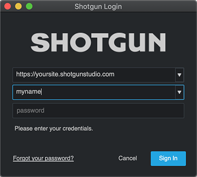

# 커스텀 스크립트에서 인증 및 로그인 자격 증명 관련 작업은 어떻게 진행합니까?

## 오류 메시지
스크립트에서 아래와 같은 오류가 표시되는 경우 Shotgun 사이트에 액세스할 권한이 없음을 의미합니다.

```text
tank.errors.TankError: Missing required script user in config '/path/to/your/project/config/core/shotgun.yml'
```
사용자 인증 또는 스크립트 인증이 사전에 제공되지 않은 경우 툴킷은 구성의 `shotgun.yml` 파일에 정의된 자격 증명을 확인하기 위해 폴백합니다.
`shotgun.yml` 파일에서 자격 증명을 정의하는 것은 과거에 인증을 처리하던 방식입니다.
`shotgun.yml` 파일에서 자격 증명을 정의하는 대신 아래에 설명된 방법 중 하나를 사용하십시오.

## 사용자 대상 스크립트
사용자 대상 스크립트의 경우 `Sgtk` 인스턴스를 생성하기 전에 다음을 시작 부분에 추가할 수 있습니다.

```python
# Import the Toolkit API so we can access Toolkit specific features.
import sgtk

# Import the ShotgunAuthenticator from the tank_vendor.shotgun_authentication
# module. This class allows you to authenticate either programmatically or, in this
# case, interactively.
from tank_vendor.shotgun_authentication import ShotgunAuthenticator

# Instantiate the CoreDefaultsManager. This allows the ShotgunAuthenticator to
# retrieve the site, proxy and optional script_user credentials from shotgun.yml
cdm = sgtk.util.CoreDefaultsManager()

# Instantiate the authenticator object, passing in the defaults manager.
authenticator = ShotgunAuthenticator(cdm)

# Optionally clear the current user if you've already logged in before.
authenticator.clear_default_user()

# Get an authenticated user. In this scenario, since we've passed in the
# CoreDefaultsManager, the code will first look to see if there is a script_user inside
# shotgun.yml. If there isn't, the user will be prompted for their username,
# password and optional 2-factor authentication code. If a QApplication is
# available, a UI will pop-up. If not, the credentials will be prompted
# on the command line. The user object returned encapsulates the login
# information.
user = authenticator.get_user()

# print "User is '%s'" % user

# Tells Toolkit which user to use for connecting to Shotgun. Note that this should
# always take place before creating a Sgtk instance.
sgtk.set_authenticated_user(user)

#
# Add your app code here...
#
# When you are done, you could optionally clear the current user. Doing so
# however, means that the next time the script is run, the user will be prompted
# for their credentials again. You should probably avoid doing this in
# order to provide a user experience that is as frictionless as possible.
authenticator.clear_default_user()
```

`QApplication`을 사용할 수 있다면 다음과 유사한 항목을 볼 수 있습니다.





## 비-사용자 대상 스크립트
스크립트가 렌더 팜 또는 이벤트 처리기처럼 사용자 대상 유형이 아닌 경우에는 Sgtk/Tank 인스턴스를 생성하기 전에 다음을 시작 부분에 추가할 수 있습니다.

```python
# Import Toolkit so we can access to Toolkit specific features.
import sgtk

# Import the ShotgunAuthenticator from the tank_vendor.shotgun_authentication
# module. This class allows you to authenticate either interactively or, in this
# case, programmatically.
from tank_vendor.shotgun_authentication import ShotgunAuthenticator

# Instantiate the CoreDefaultsManager. This allows the ShotgunAuthenticator to
# retrieve the site, proxy and optional script_user credentials from shotgun.yml
cdm = sgtk.util.CoreDefaultsManager()

# Instantiate the authenticator object, passing in the defaults manager.
authenticator = ShotgunAuthenticator(cdm)

# Create a user programmatically using the script's key.
user = authenticator.create_script_user(
    api_script="Toolkit",
    api_key="4e48f....<use the key from your Shotgun site>"
)

# print "User is '%s'" % user

# Tells Toolkit which user to use for connecting to Shotgun.
sgtk.set_authenticated_user(user)
```


