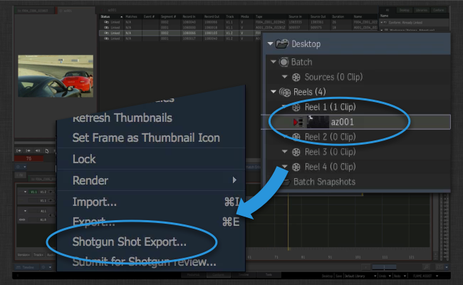
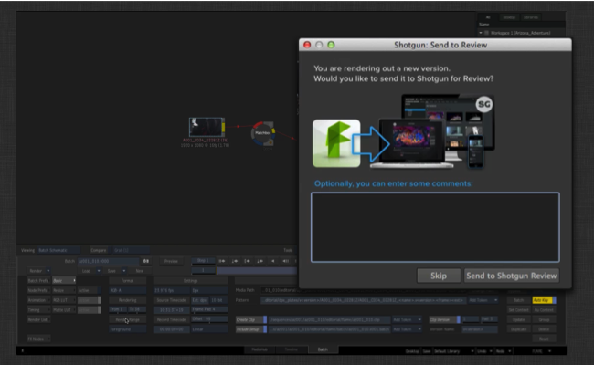

# Flame 导出

 Flame 导出应用可帮助您快速开始项目！

在 Flame 中创建初始套底后，镜头导出器可帮助您在  中快速生成内容，将图版渲染到磁盘，并发送内容以供审看。

当流程开始正常运转后，导出器应用还会跟踪 Flare 或 Flame 批处理模式下发生的所有渲染，让您在工作流中轻松将内容送去审看。

## 向  推送套底

当您在 Flame 中为一个场设置了套底，并为时间线中的所有分段**分配了镜头名称**后，选择该场，单击鼠标右键并选择“ 镜头导出”(Flame Shot Export)选项。



此时将显示一个  用户界面，您可以在其中为发布输入一些初始注释。这些注释将被送去审核。另外，在向发布和其他内容添加说明信息时，也会使用这些注释。

除了说明信息外，您还可以选择要为导出的图版使用哪种输出数据格式。这些预设是 Toolkit 应用配置的一部分，您可以配置它们来满足自己工作室的需要。


单击“提交”(Submit)按钮后，将立即执行以下操作：

- 将在  中创建镜头和任务。通过任务模板设置，可配置要与创建的每个新镜头关联的任务列表，以便快速轻松地创建一致的结构。默认情况下，镜头将以镜头序列为父项，但是您也可以对此进行配置，并且如果您处理的是场景或集结构，可以重新配置导出器支持这些设置。

- 当  包含正确的数据后，将使用标准文件夹创建机制在磁盘上创建文件夹。这将确保项目可以快速启动，创建的所有镜头都有一套统一的文件夹结构。

执行上面两个步骤后，您便有了进行后续操作的基本结构。后台将执行以下操作：

- 根据配置中定义的预设，在磁盘上导出每个镜头的图版。文件位置使用 Toolkit 模板系统进行定义，这意味着这些图版的位置定义清楚，工作流中的其他下游工具可以识别它们。

- 将导出批处理文件和视频片段 XML 文件。Flame 将使用这些内容启用一个迭代工作流，您可以在其中快速渲染新的版本，然后将它们导入 Flame 中的主套底。

- 生成 QuickTime 影片并上传至  进行审看。


## 发送批处理渲染进行审看

为镜头发布了 Flame 批处理文件后，您可以直接从该镜头启动 Flare，打开预填充了渲染和输出设置的批处理文件。要渲染出新的版本，只需单击“Render Range”按钮即可。


Toolkit 会在此时显示一个对话框，让您选择是否将渲染发送至  进行审看。



 将发布并跟踪文件，并且也可选择将文件送去审看。

## 想了解更多信息？

如果您想了解更多信息以及此工作流的实际操作，请参见 Flame 插件文档。另外，我们还在文档中提供了一些演示各种工作流实际操作的视频内容。

LINKBOX_ENGINE：software/tk-flame：Flame 插件

与往常一样，如果您对集成或自定义有任何疑问，请随时与我们的技术支持团队联系：toolkitsupport@shotgunsoftware.com

# 高级主题

下面提供了更多与配置和自定义相关的高级详细信息。

## 使用导出预设

导出器在其配置中使用了“导出预设”的概念。**当您在 Flame 内启动导出用户界面时，将看到一个下拉列表，其中包含可用的导出预设。每个预设都是一个配置选项，通过它可配置将文件写入磁盘和上传至  的方式。诸如文件在磁盘上的位置等高级设置直接在环境配置中进行控制，以易于调整默认的配置选项来适合您的工作流。

更高级的设置，以及为控制 Flame 而对传递给 Flame 的实际导出 XML 内容施加的控制，则由一个挂钩进行处理，其中定义了每个预设的行为。在该挂钩中，您可以完全控制导出器生成媒体的方式。

## 绕过  服务器端转码
默认情况下，我们通过设置 `Version.sg_uploaded_movie` 字段，将 QuickTime 影片上传至  进行审看。这进而会触发  服务器端转码；上传的 QuickTime 影片会进一步转换为专为在浏览器中和移动设备上播放而定制的 `mp4` 和 `webm` 格式。有时，绕过这种服务器端转码可能会有好处。我们可以通过设置 `bypass_shotgun_transcoding` 配置设置来做到这一点。当此设置为 True 时，集成会直接上传至  中的 `Version.sg_uploaded_movie_mp4` 字段，从而绕过服务器端转码。这种情况下，不会生成 `webm` 版本，因此在 Firefox 中无法进行审看播放。

有关详细信息，请参见 https://support.shotgunsoftware.com/hc/zh-cn/articles/219030418。

## 自定义 ffmpeg

导出器在生成 QuickTime 影片时，使用 Flame 随附的 ffmpeg 版本。您可以通过修改导出器中的设置挂钩，指定使用某个外部 ffmpeg 版本来代替内置版本。随 Flame 一起分发的 ffmpeg 版本将跟踪 ffmpeg 转码和性能方面的最新进展，因此使用最新版本有时会带来性能提升。

请注意，与默认使用的版本相比，最新版本中向 ffmpeg 传递 h264 参数的方式有所变化。通过切换到最新版本的 ffmpeg，可以丝毫不差地实施建议的转码指导原则，在  端实现最优的上传和性能。您可以在以下位置找到这些指导原则：

https://support.shotgunsoftware.com/hc/zh-cn/articles/219030418

仅当您是高级用户时，我们才建议更改 ffmpeg 版本。在这种情况下，请按以下步骤操作：

### 复制设置挂钩

您可以在 Flame 导出应用随附的设置挂钩中找到需要修改的所有设置。要修改此挂钩，首先需要将此挂钩文件从应用内的默认位置复制到您的配置中。在您的项目配置中，该挂钩文件通常位于类似如下位置：`install/apps/app_store/tk-flame-export/va.b.c/hooks/settings.py`。将此文件复制到配置内的 `hooks` 位置，例如 `config/hooks`。建议将它重命名为比 `settings.py` 更详细的名称，以便对文件的性质一目了然：

```
install/apps/app_store/tk-flame-export/va.b.c/hooks/settings.py -> config/hooks/flame_export_settings.py
```

接下来，编辑 Flame 环境配置文件。此文件通常为 `config/env/includes/flame.yml`。在 `tk-flame-export` 标题下，您会发现挂钩路径定义为 `settings_hook: '{self}/settings.py'`。这实际意味着，配置将在应用所在位置（例如 `{self}`）内查找挂钩文件。将此设置更改为 `settings_hook: '{config}/flame_export_settings.py'` 将指示 Toolkit 改为在配置内查找挂钩文件。总结如下：

```
settings_hook: '{self}/settings.py' -> '{config}/flame_export_settings.py'
```

### 修改挂钩

现在，我们已准备好开始修改 `config/hooks/flame_export_settings.py` 挂钩！在文本编辑器中打开它。您会发现几个与 ffmpeg 和 ffmpeg 设置相关的方法。首先要修改的是以下内容：

```
def get_external_ffmpeg_location(self):
    """
    Control which version of ffmpeg you want to use when doing transcoding.
    By default, this hook returns None, indicating that the app should use
    the built-in version of ffmpeg that comes with Flame.

    If you want to use a different version of ffmpeg, simply return the path
    to the ffmpeg binary here.

    :returns: path to ffmpeg as str, or None if the default should be used.
    """
    return None
```

默认情况下，导出器返回 `None`，将使用 Flame 的内置 ffmpeg。更改此设置，使其返回您的 ffmpeg 的完整路径。记住，如果您运行的是 Backburner 集群，可能会从集群内的任何计算机调用 ffmpeg，因此请确保所有位置都安装了可执行文件。

更新 ffmpeg 位置后，您很可能需要或者想要调整传递给 ffmpeg 的参数。这需要使用两个不同的方法进行更改：

- `get_ffmpeg_quicktime_encode_parameters` 将返回生成上传至  的 QuickTime 影片时使用的参数。

- `get_local_quicktime_ffmpeg_encode_parameters` 将返回向磁盘写入 QuickTime 影片时使用的参数。

对于  上传，建议开始时使用默认的  编码设置：

```
def get_ffmpeg_quicktime_encode_parameters(self):
    return "-vcodec libx264 -pix_fmt yuv420p -vf 'scale=trunc((a*oh)/2)*2:720' -g 30 -b:v 2000k -vprofile high -bf 0"
```

对于本地  转码，建议以  转码设置为基础设定您的设置，但是要删除分辨率约束并增大码率：

```
def get_local_quicktime_ffmpeg_encode_parameters(self):
    return "-vcodec libx264 -pix_fmt yuv420p -g 30 -b:v 6000k -vprofile high -bf 0"
```

