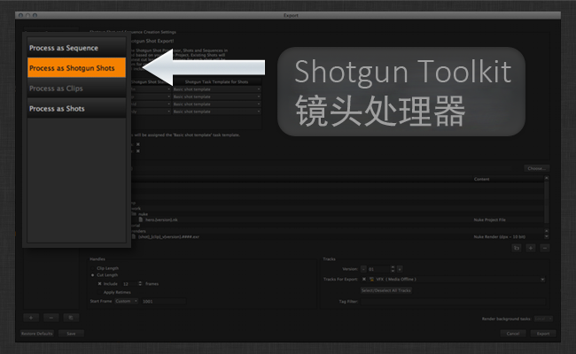
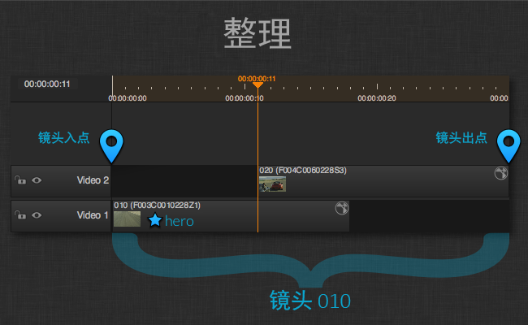
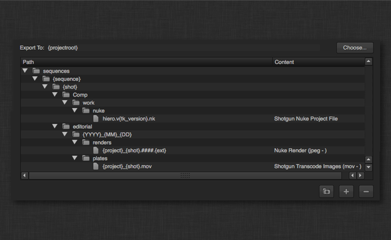
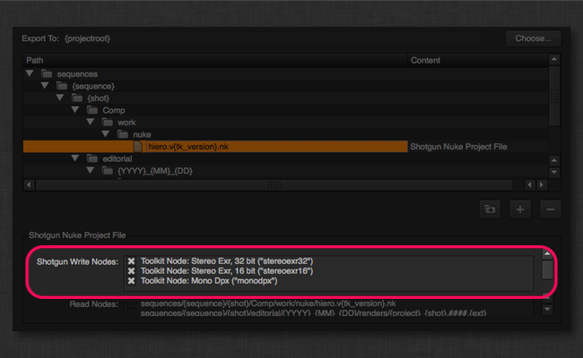

# Hiero/Nuke Studio 导出

### 简介

此应用为 Hiero 的场导出对话框添加  感知功能。

#### 概述视频和演示

如果您是刚刚接触  Toolkit 或 Hiero 集成，请观看下面的视频，快速了解一下  Toolkit Hiero 集成在您的工作流中能做些什么。

如果您已熟悉 Toolkit 和 Hiero，可以继续阅读下面的文档。

<center>
<iframe src="https://player.vimeo.com/video/82572226" style="font-size: 1em; line-height: 1.45em;" width="500" height="281" frameborder="0"></iframe>
</center>

###  镜头处理器

此应用在激活时会为 Hiero 导出对话框注册一系列更改：


首先是注册的新处理器：



当您单击此处理器时，有一些新的变化值得注意。

在对话框顶部，有一个额外的用户界面，它可以帮助您控制导出场时如何在  中创建/更新镜头：


### 标记(Tags)

通过调整下拉列表，您可以将各种 Hiero 标记映射到  镜头状态和镜头任务模板。这样，通过 Hiero 的标记工作流，您可以将某个  镜头设置为正在进行中，或者为镜头设置绿屏、CG 额外奖励或任何对您的配置有意义的任务。此用户界面通过一个挂钩填充，并且很容易配置额外奖励功能。

### 整理

应用还提供选项，控制如何对照 Hiero 的内置逻辑将轨道项整理在一起。 如果您的一个镜头由多个项构成（无论是重叠、在不同轨道上还是在多个轨道上具有相同的镜头名称），应开启这些选项。这样， Toolkit 镜头更新程序会将匹配的整理项视为一个镜头。


例如，假设我们有两个轨道项，分别代表镜头 010 和 020。010 在前，020 在不同的轨道上与 010 的结尾重叠。由于 010 在前，它是主镜头并启用了整理功能， 会将这两个项视为一个镜头 (010)。这意味着，应用将在  中创建或更新镜头 010。剪辑镜头入点将匹配轨道项 010 的开头，剪辑镜头出点将匹配轨道项 020 的结尾。应用将为每个轨道项创建一个可供审片室审看的版本，但这两个版本都将链接至镜头 010。应用还将以发布文件的形式为每个轨道项创建一个图版，但二者都将链接至镜头 010。此外，应用将发布一个 Nuke 脚本，该脚本链接至镜头 010，包含 2 个读取节点，每个项各一个节点。请注意，在这种情况下，不会在  中创建或更新镜头 020，因为它已整理到镜头 010 中。



### 路径

在  用户界面下面，是标准路径对话框。默认情况下，会通过 Hiero 向镜头添加三项内容，包括一个默认的 Nuke 脚本、一个默认的 Nuke 写入位置和一个默认的图版转码位置。 这些项的位置由应用的配置决定，并可完全使用模板系统：



此应用会向 Hiero 添加一个 `{tk_version}` 令牌，它将被替换为版本字符串，并采用  Toolkit 要求的正确格式。

### 自定义模板字段

您在 `custom_template_fields` 设置中定义的由 `resolve_custom_strings` 挂钩解析的任何令牌都将自动添加到 Hiero 的有效替换令牌列表中，并被视为 Toolkit 模板路径中的有效替换项。

例如，在 Toolkit 的 `templates.yml` 文件中，假设您使用以下内容定义一个键：

```
    resolution:
        type: str
        filter_by: alphanumeric
```

在 `tk-hiero-export` 的 `project.yml` 设置中，有以下设置：

```
  ...
  ...
  tk-hiero:
    apps:
      tk-hiero-export:
        custom_template_fields:
        - {description: Shot Resolution, keyword: resolution}
  ...
  ...
```

然后，您按如下所示修改 `resolve_custom_strings` 挂钩：

```
# Copyright (c) 2014  Software Inc.
#
# CONFIDENTIAL AND PROPRIETARY
#
# This work is provided "AS IS" and subject to the  Pipeline Toolkit
# Source Code License included in this distribution package. See LICENSE.
# By accessing, using, copying or modifying this work you indicate your
# agreement to the  Pipeline Toolkit Source Code License. All rights
# not expressly granted therein are reserved by  Software Inc.

from tank import Hook


class HieroResolveCustomStrings(Hook):
    """Translates a keyword string into its resolved value for a given task."""

    RESOLUTION_TOKEN_NAME = "{resolution}"


    def execute(self, task, keyword, **kwargs):
        """
        """

        self.parent.log_debug("attempting to resolve custom keyword: %s" % keyword)
        if keyword == self.RESOLUTION_TOKEN_NAME:
            translated_value = self._clip_resolution_string(task)
        else:
            raise RuntimeError("No translation handler found for custom_template_field: %s" % keyword)

        self.parent.log_debug("Custom resolver: %s -> %s" % (keyword, translated_value))
        return translated_value


    # Handle the {resolution_fs} token
    def _clip_resolution_string(self, task):
        """ returns sequence resolution or task format override"""
        width = ""
        height = ""

        sequence_format = task._sequence.format()

        width = sequence_format.width()
        height = sequence_format.height()

        if "reformat" in task._preset.properties():
            task_reformat_settings = task._preset.properties()["reformat"]
            if task_reformat_settings['to_type'] != "None":
                width = task_reformat_settings['width']
                height = task_reformat_settings['height']

        return "%sx%s" % (width, height)
```

现在，您不仅可以在 Hiero 中使用 `resolution` 令牌，而且它还会对照您在 Toolkit 中定义的任何模板路径进行验证，这样便可导出到一个类似如下的位置：

```
    hiero_plate_path: "sequences/{Sequence}/{Shot}/hiero_plates/{resolution}/v{version}/{project}_{Shot}.mov"
```

###  任务

注册的新任务类型有两个。

#####  转码图像

这是标准 Hiero 转码任务的一个子类，它会在  中将转码结果注册为发布。另外，还将选择性地在  中创建一个版本。如果创建了版本，还会创建一个 QuickTime 影片，并将它上传为审片室媒体。

#####  Nuke 项目文件

这是标准 Hiero Nuke 脚本导出器的一个子类，它会在  中将生成的 Nuke 脚本注册为与镜头链接的已发布文件。这些设置让您可指定导出时在文件中包含哪些支持 Toolkit 的写入节点。



`plate_published_file_type` 和 `nuke_script_published_file_type` 这两项应用设置让您可控制发布文件注册的文件类型。此外，`nuke_script_toolkit_write_nodes` 让您可控制应在导出对话框中提供哪些写入节点设置。

### 导出过程

运行导出时，导出队列中会出现一些额外的任务：


每个镜头会运行一个 ShotUpdater 任务，该任务负责在  中创建镜头，并创建数据结构配置中指定的完整镜头结构。


###  中的场和镜头更新

应用将使用 Hiero 镜头序列的名称作为镜头序列名称，并且会在镜头中填入它们的剪辑镜头信息（剪辑镜头顺序、剪辑序列开头入点、剪辑镜头入点、剪辑镜头出点、剪辑序列结尾出点、剪辑镜头时长和剪辑序列时长）。 此外，如果选择了构成镜头的镜头序列或内容项中的某些帧作为海报帧，还会上传它们作为镜头的缩略图。

如果您的工作流使用不同于**“镜头序列”(Sequence)**的其他实体作为镜头的父对象（比如**“集”(Episode)**），可以改写 `hook_get_shot` 挂钩中的 `get_shot_parent` 方法。 默认的执行会创建（如果有必要）并返回一个**“镜头序列”(Sequence)**实体。

### 剪辑镜头数据结构支持

如果您的  站点支持剪辑镜头数据结构（v7.0.0 或更高版本），此应用会自动在  中生成一个具有对应**“剪辑镜头项”(CutItem)**的**“剪辑镜头”(Cut)**。**“剪辑镜头”(Cut)**实体对应 Hiero 镜头序列，**“剪辑镜头项”(CutItem)**实体对应镜头序列中的项。 **“剪辑镜头”(Cut)**实体将链接到 `hook_get_shot` 挂钩中的 `get_shot_parent` 方法返回的父实体（默认为**“镜头序列”(Sequence)**）。 **“剪辑镜头项”(CutItem)**将与一个**“镜头”(Shot)**实体关联，并链接到导出期间创建的可审看的**“版本”(Version)**实体。 导出后，将可以在  的**“媒体”(Media)**选项卡和 **RV** 中播放该**“剪辑镜头”(Cut)**。

所有与**“剪辑镜头”(Cut)**和**“剪辑镜头项”(CutItem)**实体关联的元数据均从 Hiero 推算得出，但“Cut Type”\*\*字段除外，此字段可在导出用户界面中指定。


此处的值将显示在**“剪辑镜头”(Cut)**实体的**“类型”(Type)**字段中。

需要注意的是，选择了任意整理选项后，将不支持剪辑镜头数据结构，并会跳过**“剪辑镜头”(Cut)**和**“剪辑镜头项”(CutItem)**项的创建。

此外，剪辑镜头数据结构并不处理重定时的视频片段。导出重定时的视频片段时，会记录一条调试警告消息。

### 交替镜头层次结构

对于不采用标准“镜头序列 > 镜头”层次结构、可能会使用“集”和/或“场景”的工作室，有一个 `hiero_get_shot` 挂钩可用来配置应用，使其支持您的工作室当前使用的任何镜头层次结构。
